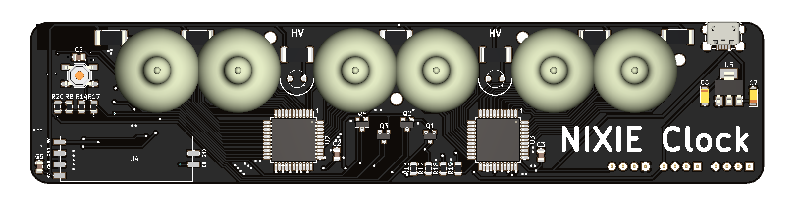
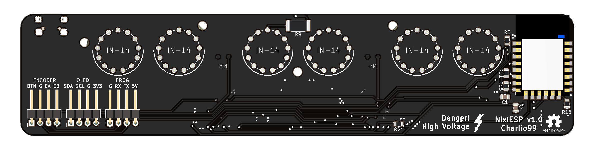
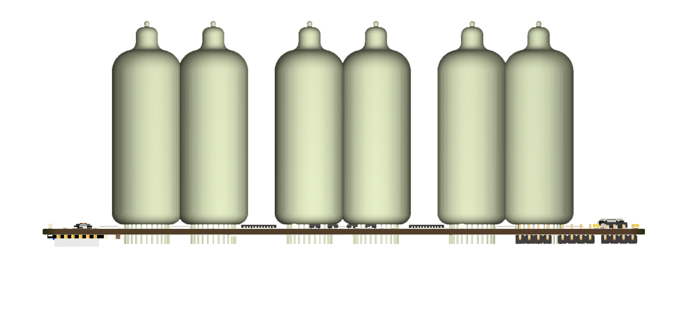

# NixiFi

NixiFi is an all in one WiFi Nixie NTP Clock board, only you have to do is to solder the components and upload the code!.

# Features

  - ESP8266 based (Arduino IDE code).
  - NTP Time.
  - No spare PSUs messing around, the 170v output is handled by a small smd PSU (link in BOM).
  - 5V Powered and it only draws 1.5-2W.
  - Oled display and encoder to configure zone, auto DST, the cathode poisoning prevention, auto shutdown between specific hours, etc.
  - Go over all numbers at specific time to avoid cathode poisoning (can be configured with the OLED display)
  - Plug and play. Once you upload the code, a WiFi network will appear, connect to it following the instructions in the OLED display.

### BOM

I mainly use JLCPCB and LCSC for PCB and components.

| Component | Quantity | Link | Price |
| ------ | ------ | ------ | ------ |
| ESP-12E | 1 | https://lcsc.com/product-detail/WIFI-Modules_ESP-12E_C89297.html | $2.2 |
| 170v PSU | 1 | https://www.ebay.es/itm/141728921034 | $9.99 |
| 100nF | 4 | https://lcsc.com/product-detail/Multilayer-Ceramic-Capacitors-MLCC-SMD-SMT_SAMSUNG_CL21B104KBCNNNC_100nF-104-10-50V_C1711.html | $0.46 |
| 1uF | 2 | https://lcsc.com/product-detail/Multilayer-Ceramic-Capacitors-MLCC-SMD-SMT_1uF-106-10-16V_C94122.html | $0.3 |
| 10uF Tantalum | 2 | https://lcsc.com/product-detail/Tantalum-Capacitors_AVX_TAJA106K010RNJ_10uF-106-10-10V_C7177.html | $0.24 |
| USB Micro B | 1 | https://lcsc.com/product-detail/Micro-USB-Connectors_Korean-Hroparts-Elec-U-F-M5DD-Y-1_C91467.html | $0.17 |
| OLED 0.96" | 1 | https://es.aliexpress.com/item/32713614136.html | $1.76 |
| Encoder | 1 | https://es.aliexpress.com/item/Rotary-Encoder-Module-Brick-Sensor-Development-for-arduino-KY-040/32462116984.html | $0.68 |
| 2N7002 | 4 | https://lcsc.com/product-detail/MOSFET_ON-Semicon_2N7002LT1G_ON-Semicon-ON-2N7002LT1G_C16338.html | $0.5 |
| 27K | 6 | https://lcsc.com/product-detail/Chip-Resistor-Surface-Mount_27KR-2702-1_C175357.html | $0.4 |
| 100K | 2 | https://lcsc.com/product-detail/Chip-Resistor-Surface-Mount_100KR-1003-1_C147046.html | $0.85 |
| 10K | 13 | https://lcsc.com/product-detail/Chip-Resistor-Surface-Mount_10KR-103-5_C100047.html | $0.14 |
| Header 4 pins | 3 | https://es.aliexpress.com/item/32847365702.html | $0.77 |
| HV5622 | 2 | https://www.arrow.com/en/products/hv5622pg-g/microchip-technology | $12.32 |
| AMS1117-3.3 | 1 | https://lcsc.com/product-detail/Low-Dropout-Regulators-LDO_AMS_AMS1117-3-3_AMS1117-3-3_C6186.html | $0.57 |
| | | **TOTAL** | **$31.35**|

Take in account that some components must be ordered in larger batches that the quantity needed and shipping costs are not included in the BOM.

### Todos

 - Adapt PCB for making it compatible with IN-8-2 without the need of modifying the IN-8-2. (At the moment it can be done cutting the dot pin and bending pin 1 to be in place of the dot.)
 - Improve README
 
### License

GNU Public License 3.0
Please, if you pretend to use it for comercial uses, contact me before

### Photos

**Open Source FTW, Hell Yeah!**
